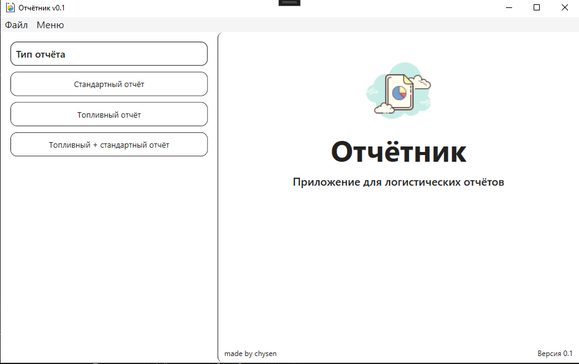
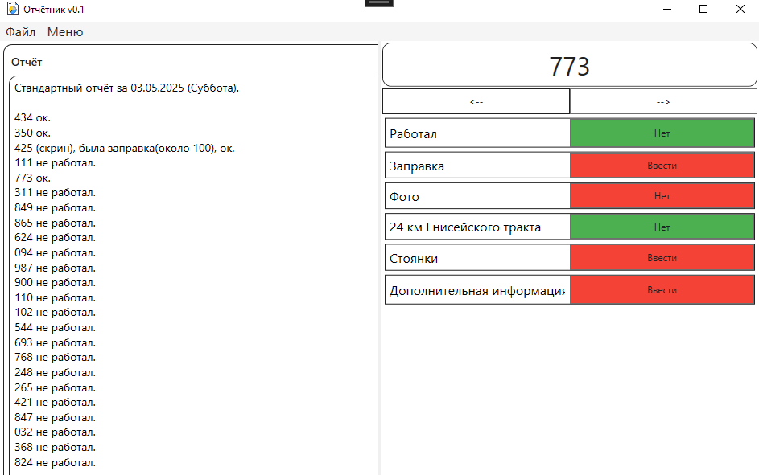

# ReportApplication

I use this application for my work. I tried to fill it with a lot of features for my self, that make my job perfomance more comfortable. It is my first serious project on WPF, earlier I use only WinForms. In this project I learned how make my own styles of wpf components, how to bind some data and I`ve made my own components.

It is 0.1 alpha version, because It needs to implement car page, where I will be able to see listview of cars.

Pictures of result:

